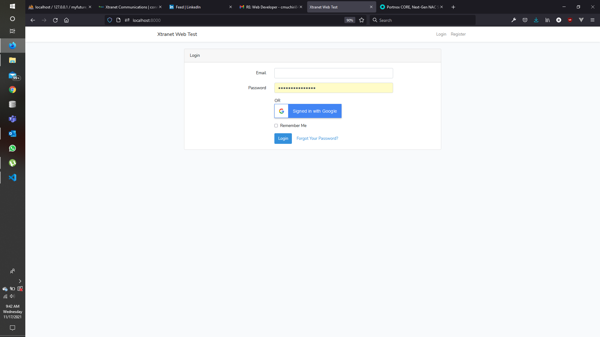
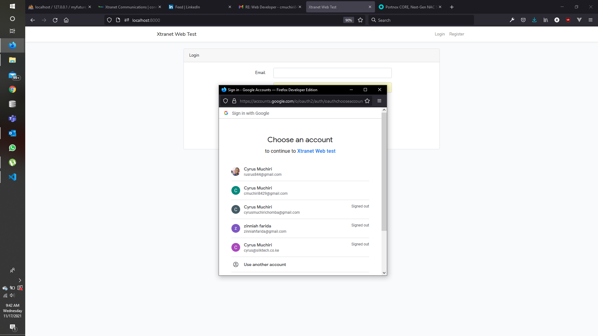
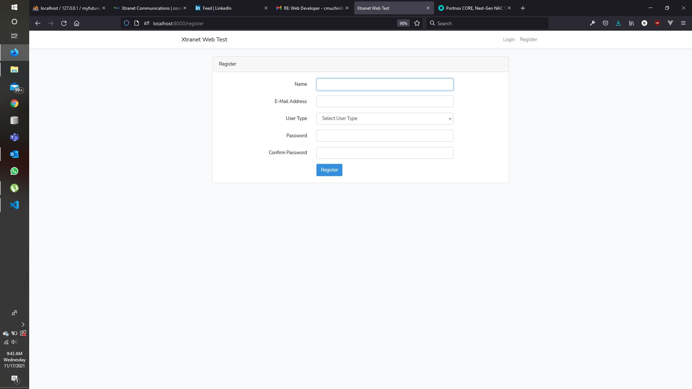
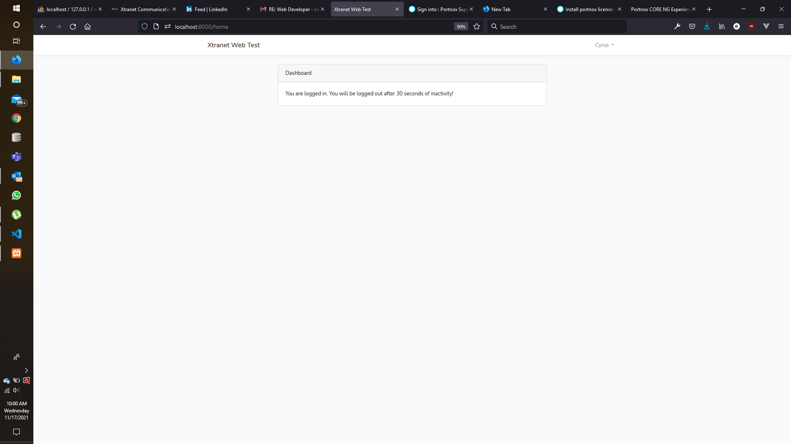

<div id="top"></div>


<!-- PROJECT LOGO -->
<br />
<div align="center">
  <a href="">
    
  </a>

  <h3 align="center">XTRANET Web Developer Test</h3>

  <p align="center">
   This readme is a guide on how to install the project 
    <br />
    
  </p>
</div>


<!-- TABLE OF CONTENTS -->
<details>
  <summary>Table of Contents</summary>
  <ol>
    <li>
      <a href="#about-the-project">About The Project</a>
      <ul>
        <li><a href="#built-with">Built With</a></li>
      </ul>
    </li>
    <li>
      <a href="#getting-started">Getting Started</a>
      <ul>
        <li><a href="#prerequisites">Prerequisites</a></li>
        <li><a href="#installation">Installation</a></li>
      </ul>
    </li>
    <li><a href="#usage">Requirements</a></li>
    <li><a href="#roadmap">Solution Overview</a></li>
    <li><a href="#contributing">ScreenShots</a></li>
    <li><a href="#contact">Contact</a></li>
    <li><a href="#acknowledgments">Acknowledgments</a></li>
  </ol>
</details>


<!-- ABOUT THE PROJECT -->
## About The Project


This login / register project is to be used for evaluation for the role of software developer for XTRANET. The project involves creating a laravel project that shows understanding of PHP, Laravel, MySQL and laravel templating engine blade

My name is Cyrus Muchiri, a candidate for this role
* I am a software developer for 4 years now
* I have a Bachelors degree in Computer Science and Technology fro JKUAT
* I am Cisco Devnet Specialist


### Built With

The project has been built with the following technologies


* [Laravel](https://laravel.com)
* [Bootstrap](https://getbootstrap.com)


<!-- GETTING STARTED -->
## Getting Started

This is an example of how you may give instructions on setting up your project locally.
To get a local copy up and running follow these simple example steps.

### Prerequisites

You will need the following installed on your computer to run this project
* php
    * For windows , download php from php.net and run the installation
    * For Ubuntu, run the following command on bash

  ```sh
  sudo apt-get install php
  ```
* mysql
    * For windows , download my sql server from 
https://dev.mysql.com/downloads/installer
 and run the installation
    * For Ubuntu, run the following command on bash
  ```sh
    sudo apt install mysql-server
  ```
 * composer
    * Installing composer on ubuntu
    ```sh
    php composer-setup.php --install-dir=bin --filename=composer
    ```
* npm
    ```sh
    npm install npm@latest -g
    ```

### Installation

_The following steps will help you clone the code repository and run the project. This assumes you have installed all the prerequisites._


1.  Clone the repo
    ```sh
    git clone https://github.com/Cyrus-Muchiri/xtranet_web_test.git
    ```
2. Change directory to project folder
   ```sh
   cd xtranet_web_test
   ```

3. Install php packages
   ```sh
   composer install
   ```

4. Create an .env file
   ```sh
   touch .env
   ```
5. Write the following to the .env file
   ```sh
        APP_NAME=Xtranet
        APP_ENV=local
        APP_KEY=base64:bFeF9t4S60TQpfK4dihZU/QFfklHaFIWqmIw7pVB4kc=
        APP_DEBUG=true
        APP_URL=http://localhost

        LOG_CHANNEL=stack

        DB_CONNECTION=mysql
        DB_HOST=127.0.0.1
        DB_PORT=3306
        DB_DATABASE=xtranet
        DB_USERNAME=root
        DB_PASSWORD=

        BROADCAST_DRIVER=log
        CACHE_DRIVER=file
        QUEUE_CONNECTION=sync
        SESSION_DRIVER=file
        SESSION_LIFETIME=120

        REDIS_HOST=127.0.0.1
        REDIS_PASSWORD=null
        REDIS_PORT=6379

        MAIL_MAILER=smtp
        MAIL_HOST=smtp.mailtrap.io
        MAIL_PORT=2525
        MAIL_USERNAME=null
        MAIL_PASSWORD=null
        MAIL_ENCRYPTION=null
        MAIL_FROM_ADDRESS=null
        MAIL_FROM_NAME="${APP_NAME}"

        AWS_ACCESS_KEY_ID=
        AWS_SECRET_ACCESS_KEY=
        AWS_DEFAULT_REGION=us-east-1
        AWS_BUCKET=

        PUSHER_APP_ID=
        PUSHER_APP_KEY=
        PUSHER_APP_SECRET=
        PUSHER_APP_CLUSTER=mt1

        MIX_PUSHER_APP_KEY="${PUSHER_APP_KEY}"
        MIX_PUSHER_APP_CLUSTER="${PUSHER_APP_CLUSTER}"

   ```


3. Create a database  by the name xtranet on phpmyadmin
    * Include the name of the database in .env
    ```env
        DB_CONNECTION=mysql
        DB_HOST=127.0.0.1
        DB_PORT=3306
        DB_DATABASE=xtranet
        DB_USERNAME=root
        DB_PASSWORD=
    ```
    * Run Database Migrations
     ```sh
        php artisan migrate
    ```
4. Start Development Server
   ```js
   php artisatan serve
   ```
<p align="right">(<a href="#top">back to top</a>)</p>


<!-- USAGE EXAMPLES -->
## Requirements

The following were the project requirements
* The solution should have 2 login options
    * Username  & password
    * Login with a 3rd Party e.g Google, Facebook or Twitter
* The login page should have a register hyperlink
* Register page should take in the name, email and password
* Password should be confirmed
* After registration, user should be taken to login page
* User should be redirected to login successful page after login
* The user login successful page should log out the user and take him to homepage after 30 seconds of inactivity

<p align="right">(<a href="#top">back to top</a>)</p>


<!-- ROADMAP -->
## Solution

* Login Screen

    The login screen allows a user to log in with username and password, or optionally with google.

    Validation is done to ensure fields are filled before submitting

    <a href="">
        
    </a>

    * Logging in with Google <br>

    <a href="">
        
    </a>

    <p align="right">(<a href="#top">back to top</a>)</p>

* Register Screen


    The register screen allows someone to create an account. A user has to provide an email , password, usertype and name
    
    <a href="">
            
        </a>

* Logged on Screen

    After a successful login , the user is directed to a logged on screen.
    The screen logs out the user after 30 seconds of inactivity

    <a href="">
            
        </a>


<!-- CONTACT -->
## Contact

Cyrus - [@cyrusmuchiri7](https://twitter.com/your_username)  - Twiter

Cyrus Muchiri - [@cyrusmuchiri7](https://github.com/Cyrus-Muchiri)  - Github

Project Link: [https://github.com/Cyrus-Muchiri/xtranet_webtest](https://github.com/Cyrus-Muchiri/xtranet_webtest)

<p align="right">(<a href="#top">back to top</a>)</p>


